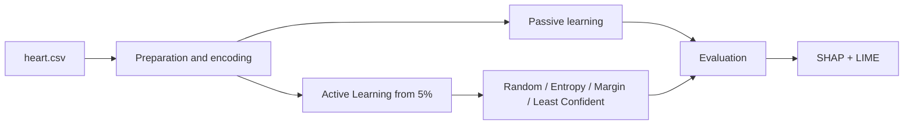

# Interpretable heart-disease prediction

[Português](README.md) | [English](README.en.md)

Human-centred AI project comparing passive learning and **Active Learning** for heart-disease prediction. Beyond predictive performance, the study uses SHAP and LIME to explain model decisions and discuss transparency in a clinical-support context.

> Academic research and demonstration prototype. It is not a medical device, does not replace professional assessment and must not support real clinical decisions.

## Research questions

- can competitive performance be achieved by labelling only part of the data?
- which acquisition strategies select the most informative samples?
- how does batch size affect learning speed and stability?
- does an initial warm-up phase improve each classifier?
- which variables influence global predictions and individual cases?

## Dataset

The study uses a dataset consolidated from five heart-disease sources. After harmonisation and duplicate removal, it contains **918 observations and 11 predictive features**, including age, sex, chest-pain type, resting blood pressure, cholesterol, fasting blood sugar, ECG, maximum heart rate, exercise-induced angina, `Oldpeak` and ST-segment slope. `HeartDisease` is the binary target.

`heart.csv` is not included in the repository. Reproducing the notebook requires a compatible file with these columns:

```text
Age, Sex, ChestPainType, RestingBP, Cholesterol, FastingBS,
RestingECG, MaxHR, ExerciseAngina, Oldpeak, ST_Slope, HeartDisease
```

## Methodology



The work compares Decision Tree, Random Forest, AdaBoost and CatBoost. Active-learning runs start with 5% labelled data and acquire samples in batches of 1, 3, 5 or 10 up to 600 examples (65.35% of the dataset). A second experiment uses 300 randomly selected warm-up samples before switching to uncertainty sampling.

## Key results

Under passive learning with a 75/25 split, Random Forest and AdaBoost reached 86.5% test accuracy and CatBoost reached 86.1%. The report identifies CatBoost as the most balanced model; during training it reached 91.7% accuracy, 92.7% F1 and 95.1% recall.

Under active learning:

- uncertainty-based strategies improved faster than random sampling;
- small batches enabled more focused updates and faster early convergence;
- CatBoost and Random Forest showed the most robust behaviour;
- a 300-sample warm-up stabilised AdaBoost but delayed improvement for CatBoost and Random Forest;
- using 65.35% of the data, the reported experiment outperformed passive learning.

SHAP highlighted `ST_Slope`, `Oldpeak`, `ChestPainType`, `ExerciseAngina` and cholesterol among the most influential features. LIME explained an individual prediction and complemented SHAP's global view. These explanations describe model behaviour, not causal clinical relationships.

## Technology stack

- Python and Jupyter Notebook;
- pandas and NumPy;
- scikit-learn and CatBoost;
- SHAP and LIME;
- Matplotlib, seaborn and Plotly.

## Repository structure

```text
HeartDisease_AI/
├── Projeto_JoséCunha_JoséFilipe_BenjamimMoreira.ipynb
├── Heart Disease Prediction based on AI.pdf
├── Project_Proposal.pdf
├── requirements.txt
├── README.md
└── README.en.md
```

## Run the notebook

```bash
git clone https://github.com/josepedrocunhazzz/Heart-Disease-Prediction-based-on-AI.git
cd Heart-Disease-Prediction-based-on-AI
python3 -m venv .venv
source .venv/bin/activate
python -m pip install --upgrade pip
python -m pip install -r requirements.txt
jupyter lab
```

Place `heart.csv` in the repository root. The notebook retains the original environment's absolute path in several cells; replace every `pd.read_csv('/Users/.../heart.csv')` call with:

```python
df = pd.read_csv("heart.csv")
```

Then run the cells in order. The Active Learning experiments iterate over many combinations and may take some time.

## Academic context

Project presented in **José Cunha's** portfolio and developed at the University of Coimbra in the context of Human-AI cooperation, explainability, trustworthiness and transparency. Full academic authorship, methodology and discussion are recorded in the [paper](Heart%20Disease%20PredictionяbasedяonяAI.pdf).
