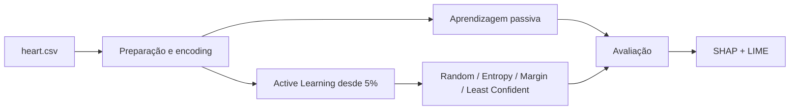

# Predição interpretável de doença cardíaca

[Português](README.md) | [English](README.en.md)

Projeto de IA centrada no humano que compara aprendizagem passiva e **Active Learning** na predição de doença cardíaca. Para além do desempenho, o estudo usa SHAP e LIME para explicar as decisões dos modelos e discutir transparência num contexto de apoio clínico.

> Protótipo académico para investigação e demonstração. Não é um dispositivo médico, não substitui avaliação profissional e não deve apoiar decisões clínicas reais.

## Questões estudadas

- é possível atingir desempenho competitivo rotulando apenas uma parte dos dados?
- que estratégias de seleção escolhem as amostras mais informativas?
- como o tamanho do batch altera a velocidade e estabilidade da aprendizagem?
- uma fase inicial de *warm-up* melhora os diferentes classificadores?
- que variáveis influenciam previsões globais e casos individuais?

## Dataset

O estudo usa um dataset consolidado a partir de cinco fontes de doença cardíaca. Depois da harmonização e remoção de duplicados, contém **918 observações e 11 variáveis preditoras**, incluindo idade, sexo, tipo de dor no peito, pressão arterial em repouso, colesterol, glicemia, ECG, frequência cardíaca máxima, angina de esforço, `Oldpeak` e inclinação do segmento ST. O alvo `HeartDisease` é binário.

O ficheiro `heart.csv` não está incluído no repositório. Para reproduzir o notebook é necessário obter uma cópia compatível com estas colunas:

```text
Age, Sex, ChestPainType, RestingBP, Cholesterol, FastingBS,
RestingECG, MaxHR, ExerciseAngina, Oldpeak, ST_Slope, HeartDisease
```

## Metodologia



Foram comparados Decision Tree, Random Forest, AdaBoost e CatBoost. Na aprendizagem ativa, as experiências começam com 5% do dataset rotulado e adicionam amostras em batches de 1, 3, 5 ou 10 até 600 exemplos (65,35% do total). Uma segunda experiência usa 300 amostras aleatórias como *warm-up* antes de mudar para amostragem por incerteza.

## Resultados principais

Na aprendizagem passiva, com divisão 75/25, Random Forest e AdaBoost alcançaram 86,5% de accuracy no teste e CatBoost 86,1%. O relatório considera o CatBoost o modelo mais equilibrado; no treino atingiu 91,7% de accuracy, 92,7% de F1 e 95,1% de recall.

Na aprendizagem ativa:

- estratégias baseadas em incerteza melhoraram mais rapidamente que a amostragem aleatória;
- batches pequenos permitiram atualizações mais focadas e convergência inicial mais rápida;
- CatBoost e Random Forest mantiveram o comportamento mais robusto;
- o *warm-up* de 300 amostras estabilizou o AdaBoost, mas atrasou a melhoria de CatBoost e Random Forest;
- com 65,35% dos dados, a experiência reportou desempenho superior à aprendizagem passiva.

SHAP destacou `ST_Slope`, `Oldpeak`, `ChestPainType`, `ExerciseAngina` e colesterol entre as features mais influentes. LIME foi usado para explicar uma previsão individual, complementando a visão global do SHAP. Estas explicações descrevem o comportamento do modelo, não relações clínicas causais.

## Tecnologias

- Python e Jupyter Notebook;
- pandas e NumPy;
- scikit-learn e CatBoost;
- SHAP e LIME;
- Matplotlib, seaborn e Plotly.

## Estrutura

```text
HeartDisease_AI/
├── Projeto_JoséCunha_JoséFilipe_BenjamimMoreira.ipynb
├── Heart Disease Prediction based on AI.pdf
├── Project_Proposal.pdf
├── requirements.txt
├── README.md
└── README.en.md
```

## Executar o notebook

```bash
git clone https://github.com/josepedrocunhazzz/Heart-Disease-Prediction-based-on-AI.git
cd Heart-Disease-Prediction-based-on-AI
python3 -m venv .venv
source .venv/bin/activate
python -m pip install --upgrade pip
python -m pip install -r requirements.txt
jupyter lab
```

Colocar `heart.csv` na raiz. O notebook conserva o caminho absoluto do ambiente original em várias células; substituir todas as chamadas `pd.read_csv('/Users/.../heart.csv')` por:

```python
df = pd.read_csv("heart.csv")
```

Depois executar as células por ordem. As experiências de Active Learning percorrem muitas combinações e podem demorar.

## Contexto académico

Trabalho desenvolvido por **Benjamim Moreira, José Filipe e José Cunha** na Universidade de Coimbra, no âmbito de Human-AI Cooperation, explainability, trustworthiness e transparency. O [artigo](Heart%20Disease%20PredictionяbasedяonяAI.pdf) apresenta a metodologia e discussão completas.
